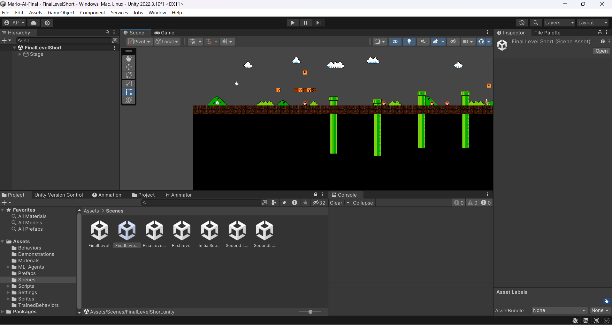
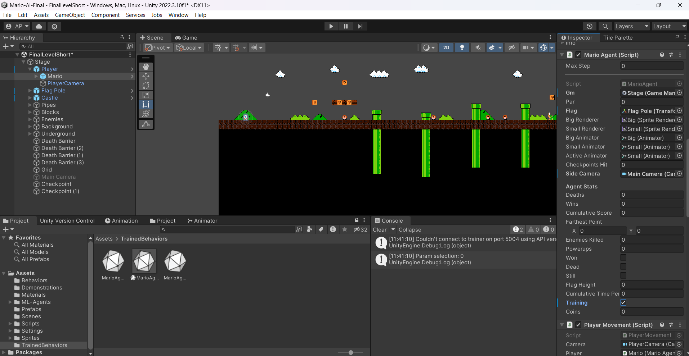
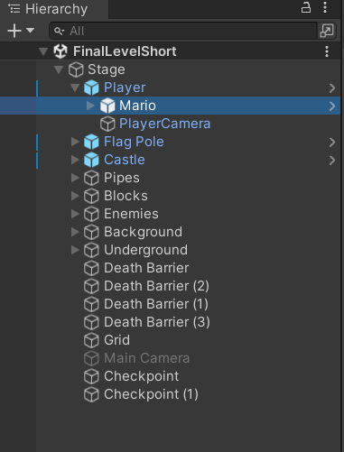
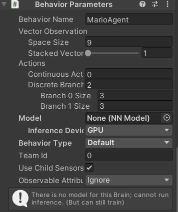
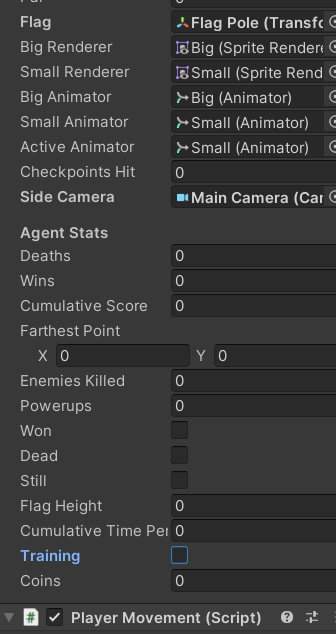
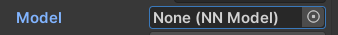

Requirements:
---------------------
python 3.9.x<br>
Unity 2022.3.10f1

Commands to run in project directory:
-------------------------------------
`py -3.9 -m venv venv`
<br>Creates a new virtual environment<br>

Activate the virtual environment:<br>
Windows:&emsp; `venv\Scripts\activate`<br>
&emsp;&ensp;&nbsp;Linux:&nbsp;&emsp;`./venv/Scripts/activate`

```
python -m pip install --upgrade pip
pip install mlagents 
pip3 install torch torchvision torchaudio
pip install protobuf==3.20.3 onnx 
```

Open Unity project (Unity version 2022.3.10f1)
----------------------------------------------
Load scene at $(SourceDir)/Assets/scenes/FinalLevelShort


Before Training
--------------
Ensure that the "Mario" game object is in training mode, by finding it under Stage -> Player -> Mario, and enabling the "Training" checkbox in the inspector under "Mario Agent"


Reinforcement Learning
------------------------
In the virtual enironment, run the command <br>
`mlagents-learn Assets\Behaviors\Reinforcement.yaml --run-id=reinforcement --force`<br>

Allow training to run for as long as wanted/needed

Imitation Learning
-------------------------
Run the following commands in order in the virual environment<br>

`mlagents-learn Assets\Behaviors\Imitation.yaml --run-id=imitation --force`<br>

Wait for completion<br>

`mlagents-learn Assets\Behaviors\Imitation2.yaml --run-id=imitation --resume`<br>

Wait for completion<br>

`mlagents-learn Assets\Behaviors\Imitation3.yaml --run-id=imitation --resume`<br>

Wait for completion<br>

`mlagents-learn Assets\Behaviors\Imitation4.yaml --run-id=imitation --resume`<br>

Allow training for as long as needed/wanted


Curriculum Learning
----------------------
Run the following command in the virtual environment <br>
`mlagents-learn Assets\Behaviors\Curriculum.yaml --run-id=curriculum --force`<br>

Completed AI
--------------------
In Unity, on the top left, expand Stage -> Player ->  and click "Mario", then scroll down to "Behavior Parameters" in the inspector<br>

Then, at the bottom of the screen, go to Assets/TrainedBehaviors and drag and drop "MarioAgentFail" or "MarioAgent3M" into the "Neural network" field of the inspector under "Behavior Parameters"

Finally, un-tick the checkbox labeled "Training" in the "Mario Agent" section of the "Mario" object

To undo this, simply click on dot next to the "Neural Network" field, and in the dropdown, press "None"


Visualizing Results
--------------------

To visualize results, in venv run:<br>
`tensorboard --logdir results\`<br>
and go to web address <a href="localhost:6066">`localhost:6006`</a>